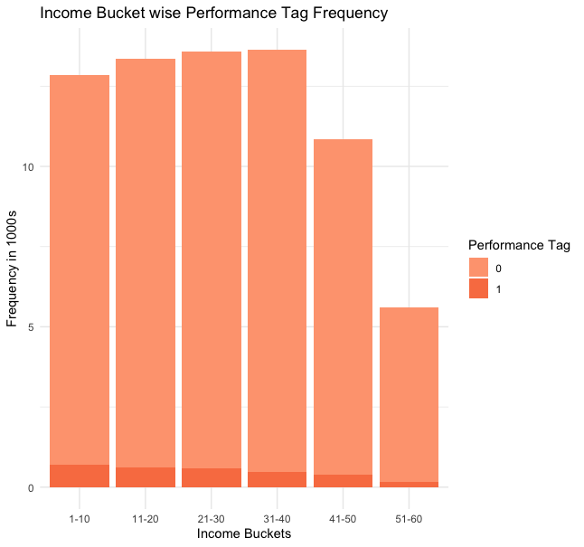

# Classification-LoanDefault
Exploratory Data Analysis of Credit Dataset and Classification on Loan Default

***

### Credit/Loan Application Data Analysis

**Gabriel Adeyemo**

***

#### 1 Introduction
The purpose of credit and loan facilities is to support businesses and families. The decision to grant or reject a loan application is based on the ability of the applicant to pay back - this is based on financial standing such as income, debt, other loans, credit history etc. Data on past applications and their performances can help banks and other lenders evaluate the risk default on a granted a loan request. The dataset in this report contains about 71 000 records of loan applications.
The objective of the analysis is to determine the important factors that contribute to loan default or non-default, explain the some of the relationships between the factors and construct models to predict performance of future application based on the trained model. The Exploratory analysis will be performed in R.
#### 2 About Data
The data for this report was provided by a Professor and a Data Scientist and can be found [here](https://github.com/dearbharat/UNBMBA6693Data). The dataset contains about 71,289 observations and 29 variables. The variables are demographic and credit information.
The variables are
- **Performance_Tag**
- Application_ID
- Age
- Gender
- Marital_Status
- No_Of_Dependents
- Income
- Education
- No_Of_Dependents
- Profession
- Type_Of_Residence
- Months_In_Current_Residence
- Months_In_Current_Company
- No_Of_90_DPD_6_months
- No_Of_60_DPD_6_months
- No_Of_30_DPD_6_months
- No_Of_90_DPD_12_months
- No_Of_60_DPD_12_months
- No_Of_30_DPD_12_months
- Trades_6_months
- Trades_12_months
- PL_Trades_12_months
- PL_Trades_6_months
- Avg_CC_Utilization_12_months
- Outstanding_Balance
- Total_No_of_trades
- Open_Auto_Loan
- Open_Home_Loan
- Inquiries_12_months
- Inquiries_6_months

Performance_Tag is the response variable. A value of 0 - default, 1- non-default
#### 3 Data Cleaning
Data cleaning operations over the data include, finding and treating missing values, removing duplicate values, merging data separated in multiple files, renaming columns, treating data types etc. A script for some data cleaning operations were also provided by the source of the data. After cleaning the data was split into train set and test set.
#### 4 Exploratory Data Analysis
Before building models for prediction, insight is derived from the data by exploring the data and the relationship among variables. To gain insight charts like bars charts, histogram, correlation matrix, boxplots.

##### 4.1  

#### 5 Model Building
#### 6 Conclusion

Loa
