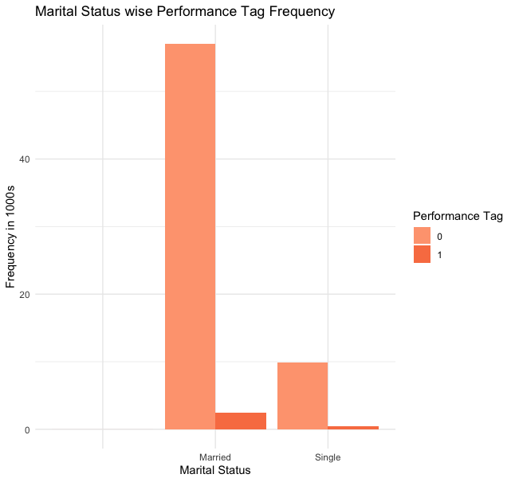
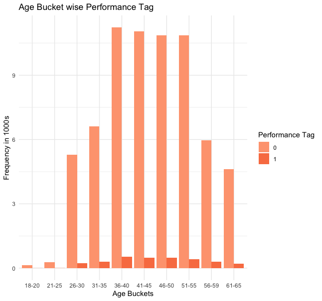
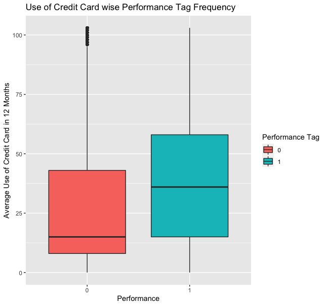
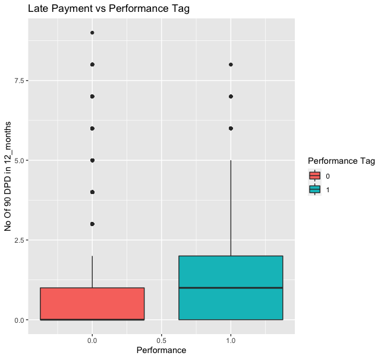
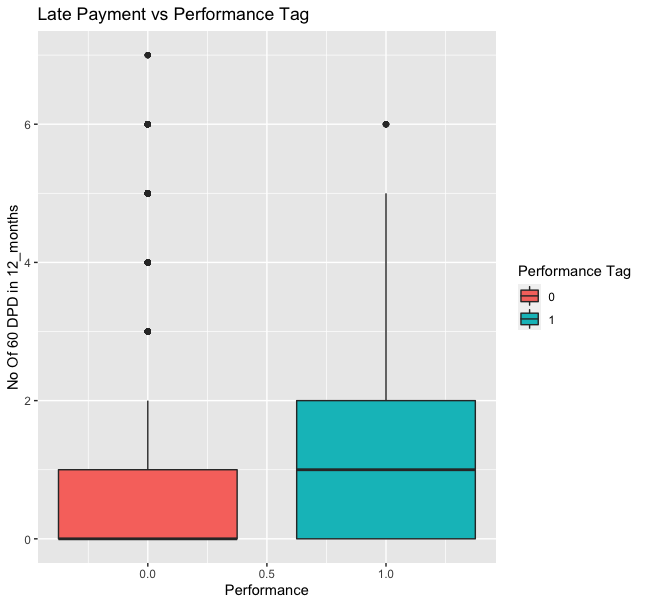
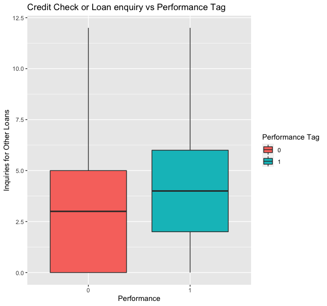
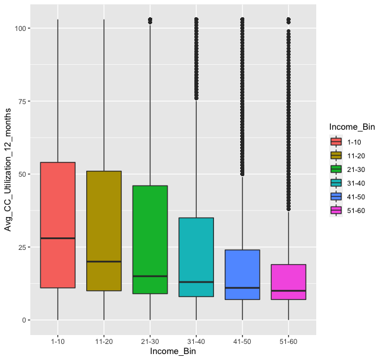
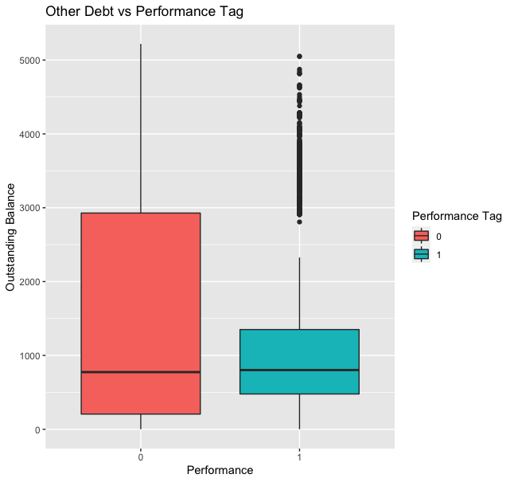
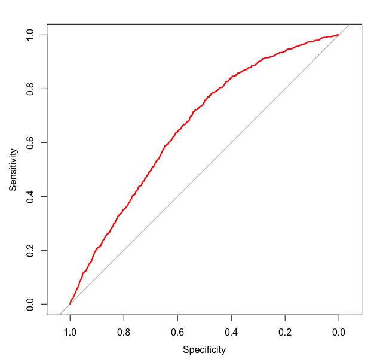

# Classification-LoanDefault
Exploratory Data Analysis of Credit Dataset and Classification on Loan Default

***

### Credit/Loan Application Data Analysis

**Gabriel Adeyemo**

***

### Credit/Loan Application Data Analysis

**Gabriel Adeyemo**

***

#### 1 Introduction
The purpose of credit and loan facilities is to support businesses and families. The decision to grant or reject a loan application is based on the ability of the applicant to pay back - this is based on financial standing such as income, debt, other loans, credit history etc. Data on past applications and their performances can help banks and other lenders evaluate the risk default on a granted a loan request. The dataset in this report contains about 71 000 records of loan applications.
The objective of the analysis is to determine the important factors that contribute to loan default or non-default, explain the some of the relationships between the factors and construct models to predict performance of future application based on the trained model. The Exploratory analysis will be performed in R.
#### 2 About Data
The data for this report was provided by a Professor and a Data Scientist and can be found [here](https://github.com/dearbharat/UNBMBA6693Data). The dataset contains about 71,289 observations and 29 variables. The variables are demographic and credit information.
The variables are
- **Performance_Tag**
- Application_ID
- Age
- Gender
- Marital_Status
- No_Of_Dependents
- Income
- Education
- No_Of_Dependents
- Profession
- Type_Of_Residence
- Months_In_Current_Residence
- Months_In_Current_Company
- No_Of_90_DPD_6_months
- No_Of_60_DPD_6_months
- No_Of_30_DPD_6_months
- No_Of_90_DPD_12_months
- No_Of_60_DPD_12_months
- No_Of_30_DPD_12_months
- Trades_6_months
- Trades_12_months
- PL_Trades_12_months
- PL_Trades_6_months
- Avg_CC_Utilization_12_months
- Outstanding_Balance
- Total_No_of_trades
- Open_Auto_Loan
- Open_Home_Loan
- Inquiries_12_months
- Inquiries_6_months

Performance_Tag is the response variable. A value of 0 - default, 1- non-default
#### 3 Data Cleaning
Data cleaning operations over the data include, finding and treating missing values, removing duplicate values, merging data separated in multiple files, renaming columns, treating data types etc. A script for some data cleaning operations were also provided by the source of the data. After cleaning the data was split into 75 percent of train set and 25 percent of test set data.
#### 4 Exploratory Data Analysis
Before building models for prediction, insight is derived from the data by exploring the data and the relationship among variables. To gain insight charts like bars charts, histogram, correlation matrix, boxplots.

##### 4.1 Marital Status 
The plot below shows the distribution of applications across married and single. Married people have more loans than single. And have more non-defaults. This may not be enough to conclude that Marital Status is directly correlated with Performance.


##### 4.2 Age



The plot shows the number of applications across various age groups. The count is low for young people which maybe due to level of responsiblity. Mid-age groups from 36 - 50 have more responsibilities like family, marriage, paying for a house, car etc, raising dependents etc, hence more loans. Less loans towards/at retirement.

##### 4.3 Credit Card Use

The figure above is a boxplot to show the relationship between the use of credit card in the last 12 months and possible loan default. The rate the use of Credit Card affect the chances of loan. The median use of credit card in 12 months is less for non-default loan. There more the credit card use the more the chances of not defaulting.There is a correlation between Performance and Credit Card use

##### 4.4 Past Late Payments

 

Exploring between relationship of late payments (30 and 60 days past due) and Performance of probablility of default.The Higher the number of Late Payments in the past the more the chances of default.

##### 4.5 Credit Check



More loan enquiries aside home and auto loans could mean the presence of other loans to service which could largerly influence loan payments. 

##### 4.5 Income and Debt
The following plots explore the distribution income which may affect loan performance. The second figure 



#### 5 Models
##### 5.1 Logistic Regression Model
From exploratory analysis of the data, multiple variables with a seemingly good relationship were chosen:
Outstanding Balance, Avg Credit card usage, Income, Loan Inquiries, Late Payments to fit a logistic regression model

```
fmla <- Performance_Tag ~ Income_Bin + Avg_CC_Utilization_12_months + No_Of_90_DPD_12_months + Inquiries_12_months + Outstanding_Balance
lrm_model <- glm(fmla, data = data_train, family = "binomial")
summary(lrm_model)

data_train$predictions <- predict(lrm_model, type = "response")
data_train$predictions <- ifelse(data_train$predictions > mean(data_train$Performance_Tag), 1, 0)
mean(data_train$Performance_Tag == data_train$predictions)

data_test$predictions <- predict(lrm_model, newdata = data_test, type = "response")
data_test$predictions <- ifelse(data_test$predictions > mean(data_test$Performance_Tag), 1, 0)
mean(data_test$Performance_Tag == data_test$predictions)
```


The p-values shown above reveal the importance of each independent variable 
The prediction with training and test data is approximately about 60 accurate using the logistic regression model.

```
> 
> data_train$predictions <- predict(lrm_model, type = "response")
> data_train$predictions <- ifelse(data_train$predictions > mean(data_train$Performance_Tag), 1, 0)
> mean(data_train$Performance_Tag == data_train$predictions)
[1] 0.5987633
> 
> data_test$predictions <- predict(lrm_model, newdata = data_test, type = "response")
> data_test$predictions <- ifelse(data_test$predictions > mean(data_test$Performance_Tag), 1, 0)
> mean(data_test$Performance_Tag == data_test$predictions)
[1] 0.5891446
```

##### 5.2 Stepwise Regression
A model with features selected via a forward stepwise regression method was built. This method does not guarantee the best model but could show some of the important model.
```
# Specify a null model with no predictors
null_model <- glm(Performance_Tag ~ 1, data = data_train, family = "binomial")

# Specify the full model using all of the potential predictors
full_model <- glm(Performance_Tag ~ ., data = data_train, family = "binomial")

step_model <- step(null_model, scope = list(lower = null_model, upper = full_model), direction = "forward")
summary(step_model)
step_prob <- predict(step_model,newdata = data_test, type="response", probability =TRUE)

library(pROC)
ROC <- roc(data_test$Performance_Tag, step_prob)
plot(ROC, col = "red")
auc(ROC)
```
The summary of the model is given as follows:
```
Call:
glm(formula = Performance_Tag ~ predictions + No_Of_30_DPD_12_months + 
    PL_Trades_6_months + Avg_CC_Utilization_12_months + Inquiries_12_months + 
    Inquiries_6_months + Total_No_of_trades + PL_Trades_12_months + 
    No_Of_90_DPD_12_months + Profession + Income + Months_In_Current_Company + 
    Months_In_Current_Residence + No_Of_90_DPD_6_months + No_Of_30_DPD_6_months + 
    No_Of_60_DPD_6_months, family = "binomial", data = data_train)

Deviance Residuals: 
    Min       1Q   Median       3Q      Max  
-0.7924  -0.3322  -0.2469  -0.2062   2.8737  

Coefficients:
                               Estimate Std. Error z value Pr(>|z|)    
(Intercept)                  -1.361e+01  8.662e+01  -0.157  0.87516    
predictions                   3.631e-02  8.396e-02   0.432  0.66543    
No_Of_30_DPD_12_months        8.471e-02  5.048e-02   1.678  0.09329 .  
PL_Trades_6_months            1.079e-01  3.471e-02   3.109  0.00188 ** 
Avg_CC_Utilization_12_months  7.787e-03  1.069e-03   7.281 3.30e-13 ***
Inquiries_12_months           9.111e-02  1.734e-02   5.254 1.49e-07 ***
Inquiries_6_months           -7.274e-02  2.554e-02  -2.848  0.00440 ** 
Total_No_of_trades           -3.499e-02  1.091e-02  -3.207  0.00134 ** 
PL_Trades_12_months           5.614e-02  2.471e-02   2.272  0.02307 *  
No_Of_90_DPD_12_months        1.443e-01  5.493e-02   2.627  0.00861 ** 
ProfessionSAL                 9.954e+00  8.662e+01   0.115  0.90851    
ProfessionSE                  1.009e+01  8.662e+01   0.117  0.90722    
ProfessionSE_PROF             9.977e+00  8.662e+01   0.115  0.90830    
Income                       -3.311e-03  1.523e-03  -2.173  0.02975 *  
Months_In_Current_Company    -2.318e-03  1.094e-03  -2.119  0.03411 *  
Months_In_Current_Residence  -1.317e-03  6.506e-04  -2.024  0.04300 *  
No_Of_90_DPD_6_months        -9.455e-02  8.910e-02  -1.061  0.28860    
No_Of_30_DPD_6_months         1.962e-01  8.071e-02   2.431  0.01508 *  
No_Of_60_DPD_6_months        -1.698e-01  8.146e-02  -2.085  0.03708 *  
---
Signif. codes:  0 ‘***’ 0.001 ‘**’ 0.01 ‘*’ 0.05 ‘.’ 0.1 ‘ ’ 1

(Dispersion parameter for binomial family taken to be 1)

    Null deviance: 18369  on 52397  degrees of freedom
Residual deviance: 17584  on 52379  degrees of freedom
AIC: 17622

Number of Fisher Scoring iterations: 11

> step_prob <- predict(step_model,newdata = data_test, type="response", probability =TRUE)
> 
> library(pROC)
> ROC <- roc(data_test$Performance_Tag, step_prob)
Setting levels: control = 0, case = 1
Setting direction: controls < cases
> plot(ROC, col = "red")
> auc(ROC)
Area under the curve: 0.6611
```
The model is evaluated by the an ROC plot (given below) and AUC. The model has an AUC of 0.66 which is not too high but relatively explains some of the relationship between the variables.


#### 6 Conclusion
Through exploratory analysis on the data on credit, we discovered that hour of the day and temperature are the two most important factors that drives the demand of bike sharing rental. Using simple linear regression model, generalized linear model, and generalized addictive model, we successfully predict the bike sharing rental count with relatively high accuracy.
